# Book Speed Analysis

Calendar time starts from `data/calendar_analysis.txt`, the cached final TSV produced by `Self_Tracking/calendar_analysis.py`. The primary minute column starts from that dataframe's overlap-adjusted `duration`, then restores full wall-clock duration for minor overlaps of 15 minutes or less and for book/audiobook rows whose larger overlaps are compatible contexts such as walking, travel, or audiobook-friendly chores. Full wall-clock time from `start_time`/`end_time` is retained separately in `first_pass_wall_clock_minutes` and used for the full-time comparison plots.

Rows above 900 WPM are not excluded. The only duration screen used for the main subset is `primary_first_pass_minutes > 90`, and every short-duration exclusion is listed below and in `book_speed_short_duration_exclusions.csv`.

## Core Files

- Calendar time: `book_calendar_first_pass_time.csv` and `book_calendar_first_pass_events.csv`
- Calendar overlap audit: `book_calendar_overlap_audit.csv`
- Calendar reconciliation: `book_calendar_time_reconciliation.csv` and `book_calendar_unmatched_includable_events.csv`
- Word counts: `book_word_counts.csv` and `book_word_count_source_audit.csv`
- Joined analysis: `book_speed_analysis.csv`
- Duration-screened subset: `book_speed_duration_screened_subset.csv`
- Visual-reading subset excluding audio-dominant books: `book_speed_visual_reading_subset.csv`
- Audio-dominant exclusions: `book_speed_audio_dominant_exclusions.csv`
- Short-duration exclusions: `book_speed_short_duration_exclusions.csv`
- High-WPM investigation: `book_speed_high_wpm_investigation.csv` and `book_speed_high_wpm_event_evidence.csv`
- >600 WPM duration-screened investigation: `book_speed_gt600_wpm_investigation.csv` and `book_speed_gt600_wpm_event_evidence.csv`

## Summary

| usable_books_before_duration_screen | duration_screened_books | excluded_lte_90_minutes | gt900_wpm_books_investigated | gt600_wpm_duration_screened_books | audio_dominant_books_excluded_from_visual_wpm | visual_reading_books_after_audio_screen | median_duration_screened_wpm | median_visual_wpm_after_350wpm_audio_adjustment |
| --- | --- | --- | --- | --- | --- | --- | --- | --- |
| 133.00 | 121.00 | 12.00 | 4.00 | 6.00 | 5.00 | 116.00 | 308.55 | 307.42 |

## WPM Percentiles

| percentile | wpm_first_pass_primary |
| --- | --- |
| 5.00 | 160.64 |
| 10.00 | 187.88 |
| 25.00 | 258.13 |
| 50.00 | 308.55 |
| 75.00 | 402.56 |
| 90.00 | 489.16 |
| 95.00 | 556.67 |

## Aggregate WPM

Aggregate WPM is `sum(chosen_word_count) / sum(primary_first_pass_minutes)`, not the mean of per-book WPMs. Full wall-clock aggregate WPM is included for comparison.

| cohort | n_finished_read_instances | total_estimated_words | total_primary_minutes | total_primary_hours | total_full_wall_clock_minutes | total_full_wall_clock_hours | aggregate_wpm | aggregate_visual_after_audio_350wpm | aggregate_full_wall_clock_wpm | mean_of_book_wpms | mean_of_book_full_wall_clock_wpms | median_book_wpm | median_book_visual_after_audio_350wpm | median_book_full_wall_clock_wpm |
| --- | --- | --- | --- | --- | --- | --- | --- | --- | --- | --- | --- | --- | --- | --- |
| all_finished_read_instances_with_word_count | 138 | 18849375.00 | 60320.00 | 1005.33 | 61602.50 | 1026.71 | 312.49 | 310.60 | 305.98 | 369.10 | 360.28 | 319.94 | 318.74 | 312.04 |
| first_reads_with_word_count | 133 | 18479482.00 | 59320.00 | 988.67 | 60602.50 | 1010.04 | 311.52 | 309.75 | 304.93 | 367.97 | 358.83 | 319.46 | 318.02 | 311.67 |
| first_reads_gt90m_with_word_count | 121 | 17917255.00 | 58405.00 | 973.42 | 59687.50 | 994.79 | 306.78 | 304.75 | 300.18 | 337.20 | 327.15 | 308.55 | 308.55 | 304.61 |
| visual_reading_first_reads_gt90m_excluding_audio_dominant | 116 | 16774020.00 | 55532.50 | 925.54 | 56687.50 | 944.79 | 302.06 | 301.21 | 295.90 | 332.69 | 323.72 | 307.42 | 307.42 | 302.99 |

## WPM By Year

| finish_year | n_books | median_wpm | mean_wpm |
| --- | --- | --- | --- |
| 2021.00 | 2.00 | 321.22 | 321.22 |
| 2022.00 | 17.00 | 259.42 | 290.23 |
| 2023.00 | 17.00 | 276.77 | 285.39 |
| 2024.00 | 28.00 | 314.06 | 332.81 |
| 2025.00 | 38.00 | 341.73 | 393.74 |
| 2026.00 | 19.00 | 289.02 | 320.68 |

## WPM By Category

| category_plot | n_books | median_wpm | mean_wpm |
| --- | --- | --- | --- |
| Business, management | 28 | 330.88 | 355.77 |
| fiction | 24 | 323.53 | 331.79 |
| Literature | 19 | 253.57 | 320.26 |
| General Reading | 17 | 324.59 | 345.25 |
| Histories | 16 | 316.87 | 337.26 |
| Unknown | 13 | 340.32 | 315.19 |
| Machine Learning | 3 | 487.41 | 373.51 |
| Computer Science | 1 | 308.55 | 308.55 |

## Highlight Effect

| n_books | pearson_corr_log_highlight_density_wpm | slope_wpm_per_log1p_highlight_density | p25_highlight_words_per_10k_words | p75_highlight_words_per_10k_words | predicted_wpm_at_p25_highlight_density | predicted_wpm_at_p75_highlight_density | observational_wpm_change_if_p75_to_p25_density |
| --- | --- | --- | --- | --- | --- | --- | --- |
| 119.00 | -0.02 | -1.12 | 0.00 | 801.48 | 339.98 | 332.48 | 7.50 |

## Highlight And Note Models

| model | response_column | predictor | n_books | coefficient_wpm_per_log1p_unit | intercept_or_baseline | r_squared | p25_predictor | p75_predictor | estimated_wpm_change_p75_to_p25 |
| --- | --- | --- | --- | --- | --- | --- | --- | --- | --- |
| unadjusted | wpm_first_pass_primary | highlight_count_per_page | 119 | -43.17 | 343.36 | 0.00 | 0.00 | 0.42 | 15.13 |
| category_fixed_effects | wpm_first_pass_primary | highlight_count_per_page | 119 | -80.58 | 374.26 | 0.02 | 0.00 | 0.42 | 28.24 |
| unadjusted | wpm_first_pass_primary | my_note_words_per_page | 119 | 21.74 | 332.22 | 0.00 | 0.00 | 0.28 | -5.38 |
| category_fixed_effects | wpm_first_pass_primary | my_note_words_per_page | 119 | 4.05 | 354.31 | 0.01 | 0.00 | 0.28 | -1.00 |

## Confidence Comparison

| confidence_subset | n_books | median_wpm | mean_wpm | aggregate_wpm | aggregate_full_wall_clock_wpm |
| --- | --- | --- | --- | --- | --- |
| high_confidence | 90 | 324.32 | 346.85 | 313.56 | 305.68 |
| medium_confidence | 31 | 263.06 | 309.20 | 277.47 | 275.96 |
| local_file_high_confidence | 90 | 324.32 | 346.85 | 313.56 | 305.68 |

## Calendar Time Reconciliation

| metric | events | calendar_analysis_minutes | wall_clock_minutes |
| --- | --- | --- | --- |
| explicit_includable_book_time | 2163.00 | 105812.97 | 111152.50 |
| assigned_to_finished_books | 1521.00 | 84164.03 | 88557.50 |
| unmatched_explicit_book_time | 642.00 | 21648.93 | 22595.00 |
| generic_temporal_not_counted | 119.00 | 2942.50 | 3070.00 |
| bare_finished_marker_not_counted | 0.00 | 0.00 | 0.00 |
| assigned_plus_unmatched_minus_explicit_total |  | 0.00 | 0.00 |

## High-WPM Investigation

| title | matched_finish_date | primary_first_pass_minutes | first_pass_wall_clock_minutes | chosen_word_count | word_count_source | wpm_first_pass_primary | wpm_first_pass_full_wall_clock | duration_screen_exclusion_reason | likely_cause |
| --- | --- | --- | --- | --- | --- | --- | --- | --- | --- |
| blueprint reading: construction drawings for the building trade | 2025-07-28 | 45.00 | 45.00 | 93071.00 | local_file_word_count | 2068.24 | 2068.24 | calendar_time_lte_90_minutes | calendar_time_lte_90_minutes |
| what is man and other essays | 2024-08-07 | 75.00 | 75.00 | 107358.00 | local_file_word_count | 1431.44 | 1431.44 | calendar_time_lte_90_minutes | calendar_time_lte_90_minutes |
| the Oxford book of essays | 2025-03-22 | 255.00 | 300.00 | 284080.00 | local_file_word_count | 1114.04 | 946.93 |  | long_book_has_too_little_matched_calendar_time |
| DFW_TV.pdf | 2025-10-09 | 105.00 | 105.00 | 111925.00 | metadata_pages_x_words_per_page | 1065.95 | 1065.95 |  | word_count_uses_page_estimate_needs_local_file_match |

## >600 WPM Duration-Screened Investigation

| title | matched_finish_date | primary_first_pass_minutes | first_pass_wall_clock_minutes | chosen_word_count | word_count_source | wpm_first_pass_primary | wpm_first_pass_full_wall_clock | duration_screen_exclusion_reason | likely_cause |
| --- | --- | --- | --- | --- | --- | --- | --- | --- | --- |
| the Oxford book of essays | 2025-03-22 | 255.00 | 300.00 | 284080.00 | local_file_word_count | 1114.04 | 946.93 |  | long_book_has_too_little_matched_calendar_time |
| DFW_TV.pdf | 2025-10-09 | 105.00 | 105.00 | 111925.00 | metadata_pages_x_words_per_page | 1065.95 | 1065.95 |  | word_count_uses_page_estimate_needs_local_file_match |
| age of ambition | 2025-08-02 | 180.00 | 210.00 | 154934.00 | local_file_word_count | 860.74 | 737.78 |  | needs_manual_calendar_or_word_count_review |
| Now It Can Be Told | 2026-01-19 | 270.00 | 360.00 | 168544.00 | local_file_word_count | 624.24 | 468.18 |  | audio_dominant_not_visual_reading_speed |
| the power broker | 2025-12-04 | 1132.50 | 1170.00 | 697127.00 | local_file_word_count | 615.56 | 595.84 |  | audio_dominant_not_visual_reading_speed |
| Designing Machine Learning Systems | 2024-11-21 | 225.00 | 225.00 | 138130.00 | local_file_word_count | 613.91 | 613.91 |  | calendar_has_only_finish_or_near-finish_events |

## Short-Duration Exclusions

| title | matched_finish_date | primary_first_pass_minutes | first_pass_wall_clock_minutes | chosen_word_count | wpm_first_pass_primary | wpm_first_pass_full_wall_clock | duration_screen_exclusion_reason |
| --- | --- | --- | --- | --- | --- | --- | --- |
| blueprint reading: construction drawings for the building trade | 2025-07-28 | 45.00 | 45.00 | 93071.00 | 2068.24 | 2068.24 | calendar_time_lte_90_minutes |
| what is man and other essays | 2024-08-07 | 75.00 | 75.00 | 107358.00 | 1431.44 | 1431.44 | calendar_time_lte_90_minutes |
| high intensity training the mike mentzer way | 2025-09-22 | 90.00 | 90.00 | 71430.00 | 793.67 | 793.67 | calendar_time_lte_90_minutes |
| The Art of Readable Code | 2022-11-30 | 75.00 | 75.00 | 56650.00 | 755.33 | 755.33 | calendar_time_lte_90_minutes |
| Tremendous Trifles | 2024-03-01 | 60.00 | 60.00 | 39050.00 | 650.83 | 650.83 | calendar_time_lte_90_minutes |
| The Inner game of tennis | 2021-10-17 | 75.00 | 75.00 | 38775.00 | 517.00 | 517.00 | calendar_time_lte_90_minutes |
| art and fear | 2025-12-15 | 60.00 | 60.00 | 27656.00 | 460.93 | 460.93 | calendar_time_lte_90_minutes |
| self help is like a vaccine | 2024-10-11 | 90.00 | 90.00 | 34712.00 | 385.69 | 385.69 | calendar_time_lte_90_minutes |
| memos from the chairman | 2026-02-25 | 90.00 | 90.00 | 32590.00 | 362.11 | 362.11 | calendar_time_lte_90_minutes |
| theory and practice of gamesmanship | 2025-06-20 | 90.00 | 90.00 | 22518.00 | 250.20 | 250.20 | calendar_time_lte_90_minutes |
| how to succeed at business without really trying | 2025-01-16 | 90.00 | 90.00 | 21917.00 | 243.52 | 243.52 | calendar_time_lte_90_minutes |
| good research code | 2022-09-09 | 75.00 | 75.00 | 16500.00 | 220.00 | 220.00 | calendar_time_lte_90_minutes |

## Plots

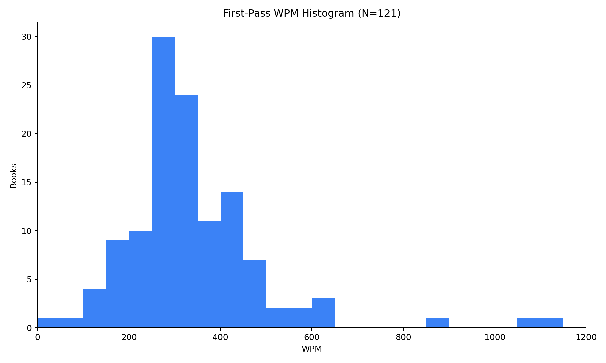

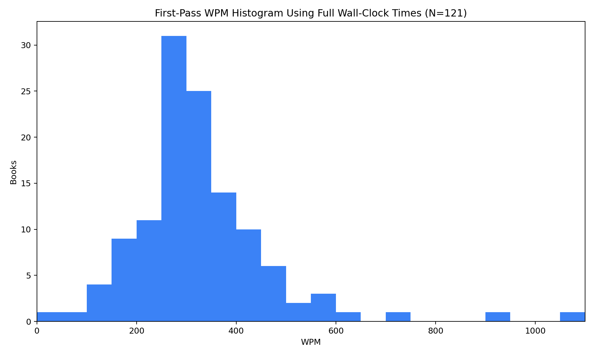

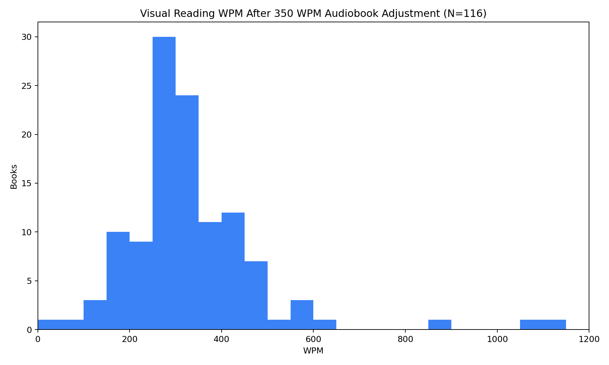

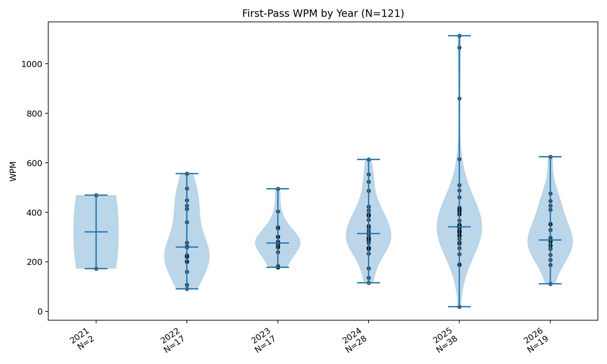

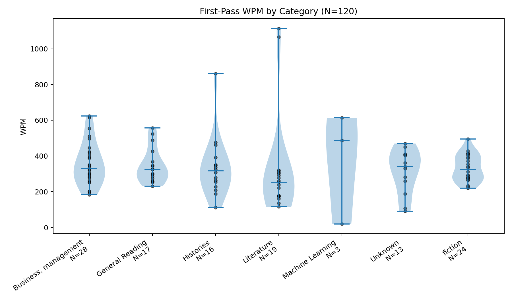

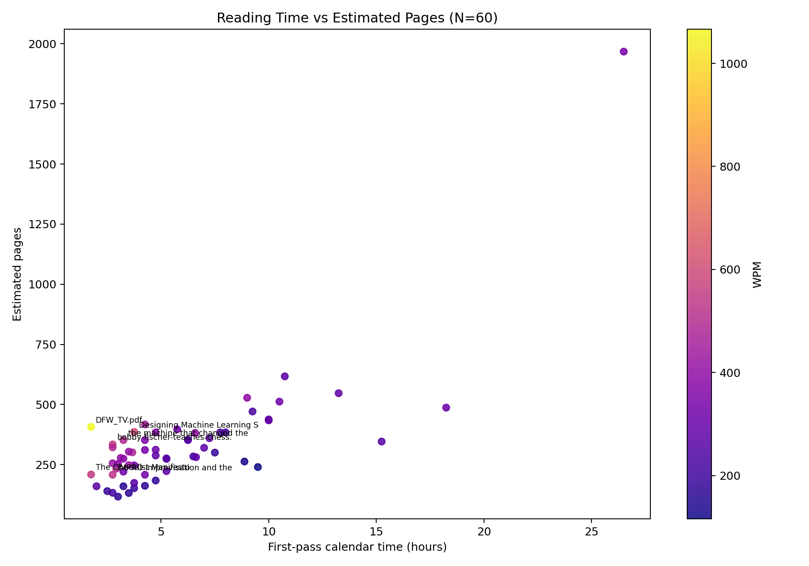

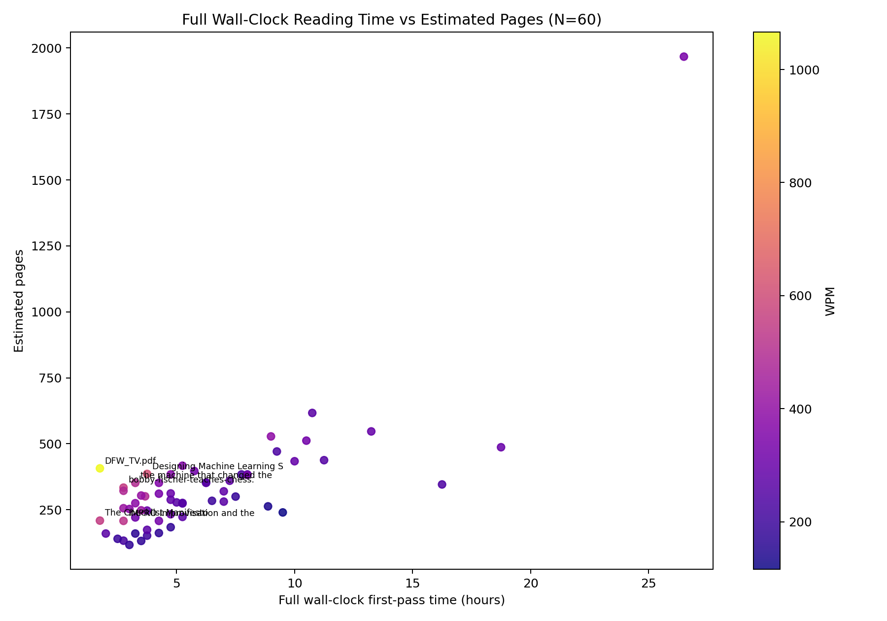

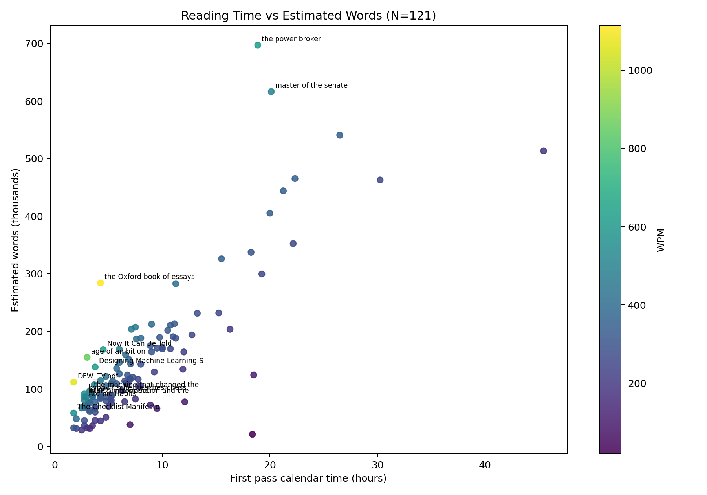

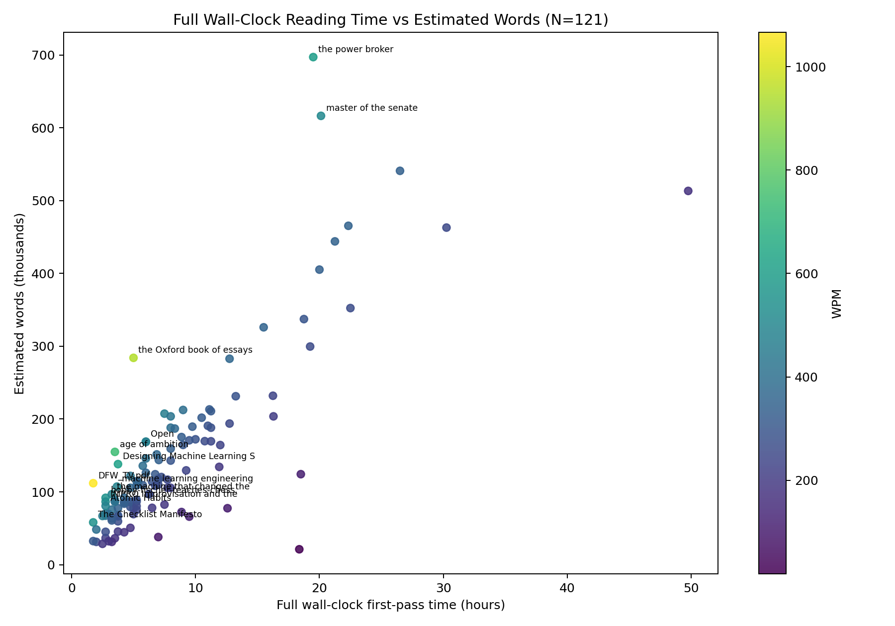

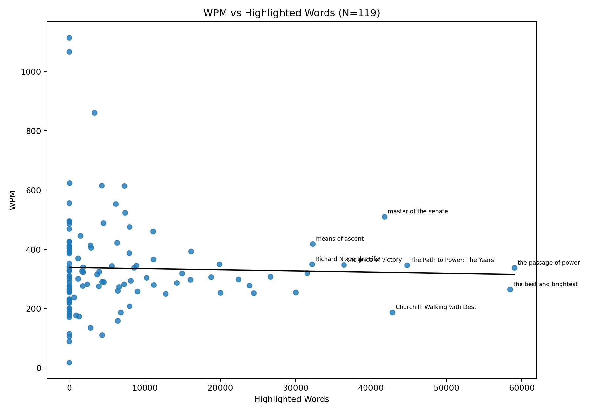

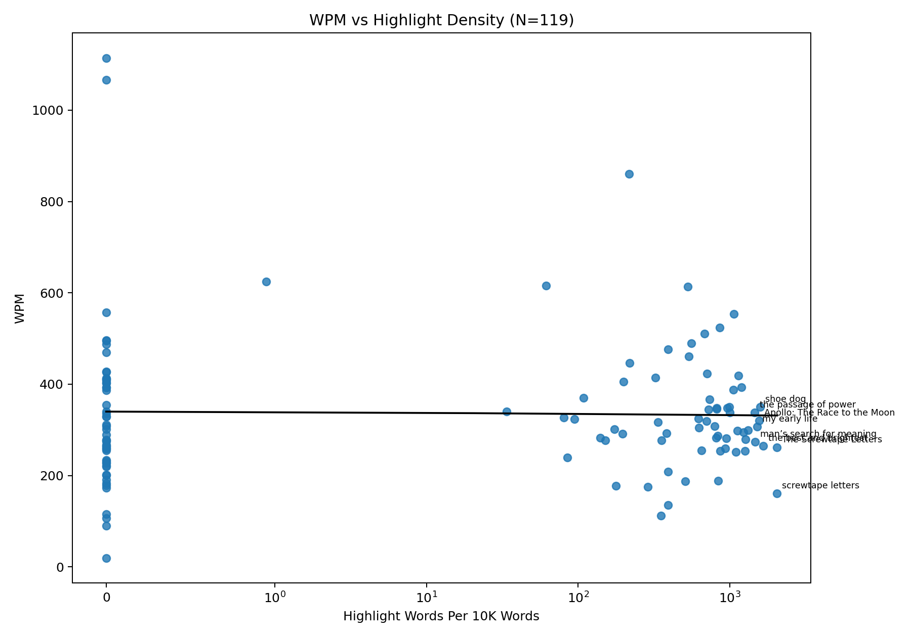

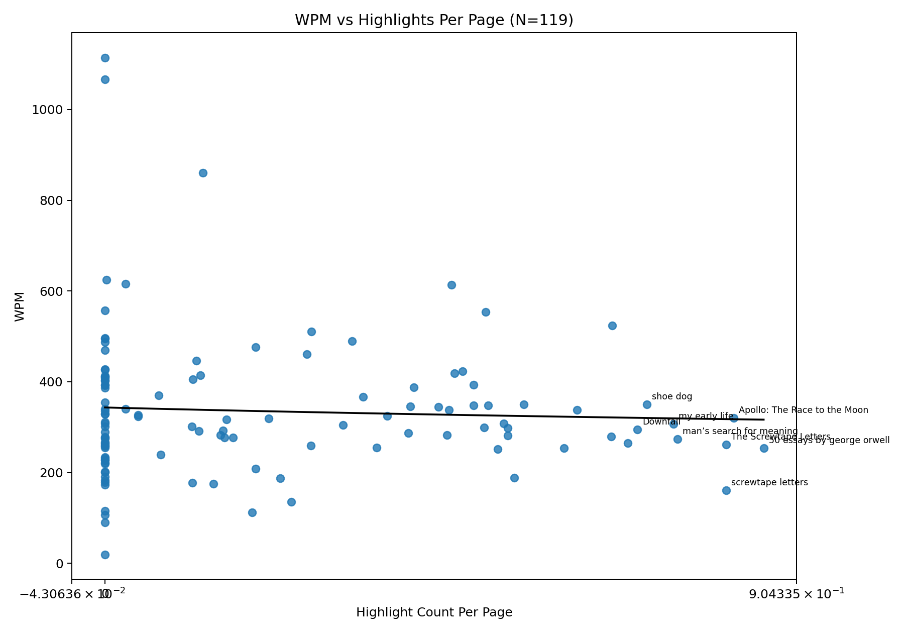

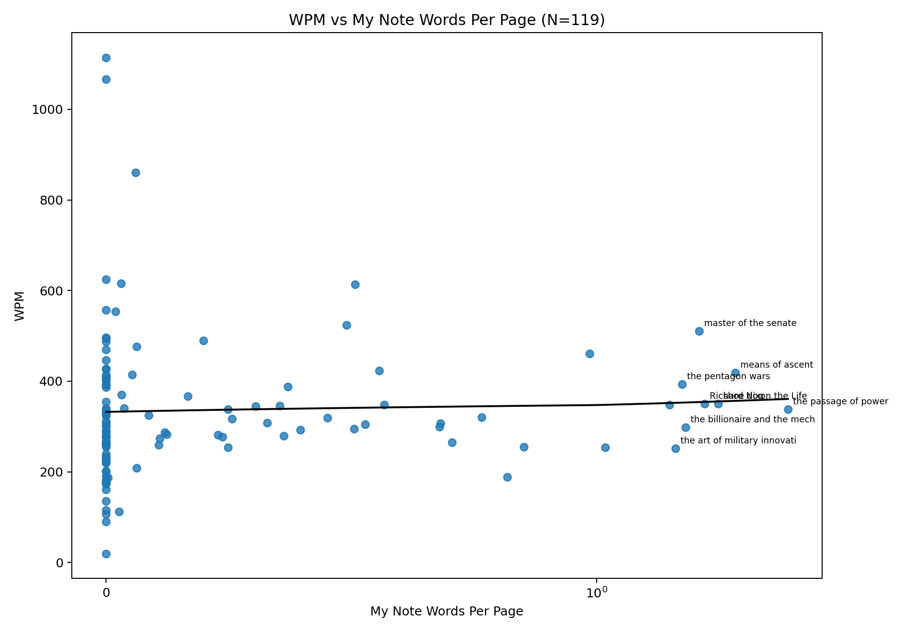

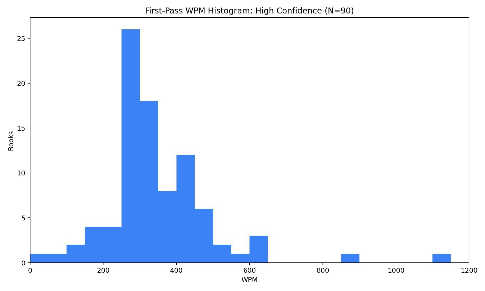

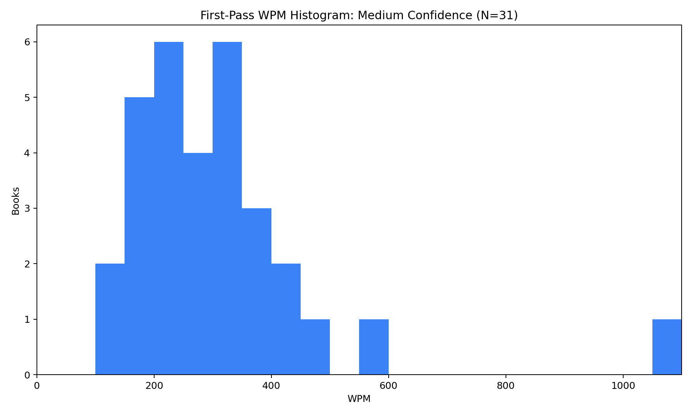
